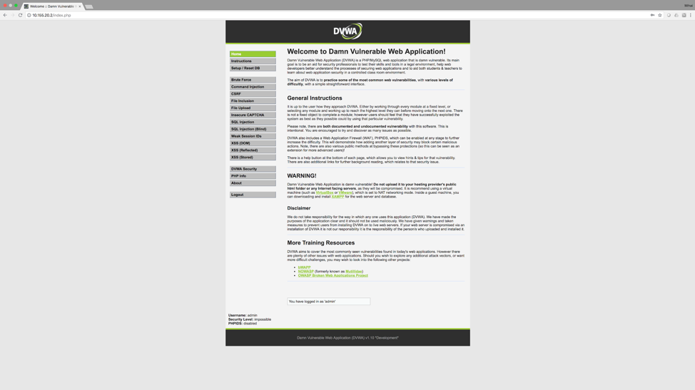

# SEED

## Goal

Today, learning or teaching the required skills for penetration testing is typically done in an environment with one virtual machine that simulates different vulnerable services, or directly on a given packet capture/binary file that contains some sensitive information. The goal of this project is two folded, first we want to create a scalable infrastructure that can reproduce real world scenarios where multiple services are available and one needs to discover the vulnerable ones, and second, we want to use the Raspberry Pi hardware to run the infrastructure, making it easily accessible and deplorable.

## Objectives

- Investigate and determine the technologies required to build a virtual infrastructure
- Create a virtual infrastructure for demo purposes 
- Run 2-3 vulnerable services as a proof of concept
- Test the infrastructure against scalability
- Build a Raspberry Pi image for easy testing and deployment

## How this will help instructors/students?

This can be used to investigate and troubleshoot different security or even network scenarios. Instructor can muse the Raspberry Pi image to rapidly deploy a vulnerable infrastructure that is similar to real-world networks. The student can use different security tools in a well controlled environment, and investigate different vulnerabilities on multiple services. 

## Which Cisco Networking Academy offerings could benefit from this project?

IoT Security, CCNA 1, CCNA Security, CCNA Cybersecurity Operations

## Setup

### Option 1

1. Download the pre-configured [SEED image](https://cisco.box.com/v/seed).

2. Flash your Raspberry Pi with [Etcher](https://etcher.io/).

### Option 2

In this section we will detail the installation and configuration of different tools used in order to allow the Raspberry Pi to run both Docker containers and Mininet hosts. Everything is automated through the initial_setup.sh script, but every step is also detailed below.
Note: Before you begin, make sure you can SSH into the Raspberry Pi and that it has Internet connection.

```bash
sudo ./initial_setup.sh
```

### Installation

Update and upgrade the software stack

```bash
sudo apt-get update
sudo apt-get upgrade -y
```

#### Install Required Software

```bash
sudo apt -y install dnsmasq vim virtualenv htop git python-pip
```

#### Install Docker

```bash
curl -fsSL get.docker.com -o get-docker.sh
sudo sh get-docker.sh
```

#### Install Mininet

```bash
git clone git://github.com/mininet/mininet
cd mininet
cat >> mininet.patch <<EOF
diff --git a/util/install.sh b/util/install.sh
index 2415324..3e38152 100755
--- a/util/install.sh
+++ b/util/install.sh
@@ -61,6 +61,7 @@ if which lsb_release &> /dev/null; then
     RELEASE=`lsb_release -rs`
     CODENAME=`lsb_release -cs`
 fi
+[ "$DIST" = "Raspbian" ] && DIST=Debian
 echo "Detected Linux distribution: $DIST $RELEASE $CODENAME $ARCH"

 # Kernel params
EOF
patch -p1 < mininet.patch
sudo ./util/install.sh -a
cd ..
rm -rf mininet
```

#### Install SEED

The seed.tar archive must be copy in the same directory as the initial_setup.sh script.

```bash
tar xvf seed.tar
cd seed
make venv
make containers
cd ..
rm -rf seed
```

### Configuration

There are two important services that are created by the initial_setup.sh script. One that will allow the Raspberry Pi to act as a DHCP server and permit direct link connectivity using the dnsmasq application, and a second service called seedapp that will act as a mechanism for keeping the flask application running. 

#### Configuration of dnsmasq

```bash
root@raspberrypi:/home/pi# cat /etc/dnsmasq.conf 
local=/seed/
domain=seed
no-hosts
interface=sw0
dhcp-range=10.255.255.200,10.255.255.254,10.255.255.0,24h
dhcp-option=1,255.255.255.0
dhcp-option=3
dhcp-option=6
dhcp-option=121,10.0.0.0/8,10.255.255.249
Configuration of seedapp service
root@raspberrypi:/home/pi/seed/containers/dvwa_docker# cat /etc/systemd/system/seedapp.service
[Unit]
Description=SEED Hackable RPI infrastructure service
Before=network-pre.target
Wants=network-pre.target
[Install]
WantedBy=multi-user.target
[Service]
User=root
Group=root
ExecStart=/home/pi/seed/.venv/bin/python2 /home/pi/seed/run_dev.py
ExecStartPost=/bin/sleep 5
ExecStartPost=/sbin/brctl addif sw0 eth0
ExecStartPost=/sbin/ip a flush sw0
ExecStartPost=/sbin/ip a a 10.255.255.249/24 dev sw0
ExecStartPost=/sbin/ip r a 10.7.6.0/24 via 10.255.255.2
ExecStartPost=/sbin/ip r a 10.88.205.0/24 via 10.255.255.1
ExecStartPost=/sbin/ip r a 10.155.20.0/24 via 10.255.255.4
ExecStartPost=/sbin/ip r a 10.5.140.0/24 via 10.255.255.4
ExecStopPost=/sbin/brctl delif sw0 eth0
ExecStopPost=/sbin/ip a flush sw0
Restart=on-failure
```

## SEED - Web Interface Installation

The web interface allows to start/stop the 3 LANs that were created for this demo purposes. Each LAN is compose of a number of switches/routers that are started by default with the “seedapp” service (this can be changed for future releases, but it was easier for testing purposes), and one Docker container and NO x Mininet hosts (a LAN can also have more than one Docker container if required). 
When selected the number of Mininet hosts will be started together with the Docker container. By default, only one Mininet host will start.


 
## Vulnerable Docker Images

### Damn Vulnerable Web Application (DVWA)

#### Installation

SSH to the Raspberry Pi and create a local directory call dvwa_docker. Copy the Dockerfile, Makefile, config.inc.php, init_mysql.sql, init_mysql.sql.old, php.ini, start_app.sh files to that folder.

```bash
root@raspberrypi:/home/pi/seed/containers/dvwa_docker# ls
Dockerfile  Makefile  config.inc.php  init_mysql.sql  init_mysql.sql.old  php.ini  start_app.sh
```

Build the Docker image using the provided Docker file (here we are naming the created image “dvwa”, this can be replace for a larger deployment). Note that in order for this to complete, the RPI must have Internet connection. This can take about 5 minutes, depending to you Internet connection speed.

```bash
root@raspberrypi:/home/pi/iot_docker# docker build -t dvwa
```

#### Usage

After the Docker DVWA vulnerable Docker has been create, you can test its configuration issuing the following commands. First make sure that the image is created.

```bash
root@raspberrypi:/home/pi# docker images
REPOSITORY          TAG                 IMAGE ID            CREATED             SIZE
dvwa                latest              bc9068ef8006        4 hours ago         373MB
```

Second, start a temporary Docker container and forward local port 8888 to the Docker port 80.

```bash
root@raspberrypi:/home/pi# docker run --rm -it -p 8888:80 dvwa
 * Starting MySQL database server mysqld                                                                                                                                      [ OK ] 
 * Checking for tables which need an upgrade, are corrupt or were 
not closed cleanly.
ERROR 1064 (42000) at line 87: You have an error in your SQL syntax; check the manual that corresponds to your MySQL server version for the right syntax to use near 'root@58419dbbc5e1:/
create user 'dvwa'@'localhost' IDENTIFIED BY 'p@ssw0rd'' at line 1
 * Starting web server apache2                                                                                                                                                       AH00558: apache2: Could not reliably determine the server's fully qualified domain name, using 172.17.0.3. Set the 'ServerName' directive globally to suppress this message
 * 
Sleeping now ...
==> /var/log/apache2/access.log <==
```

Now, the page should be accessible by using the following URL: ```<RPI_IP_ADDRESS>:8888```


 
### IoT Vulnerable Dashboard (IoT Security)

#### Installation

SSH to the Raspberry Pi and create a local directory call iot_docker. Copy the Dockerfile, app.py and init_mysql.sql files to that folder.

```bash
  root@raspberrypi:/home/pi/iot_docker# ls
  Dockerfile  app.py  init_mysql.sql
```

Build the Docker image using the provided Docker file (here we are naming the created image “iot”, this can be replace for a larger deployment). Note that in order for this to complete, the RPI must have Internet connection. This can take about 5 minutes, depending to you Internet connection speed.

```bash
  root@raspberrypi:/home/pi/iot_docker# docker build -t iot
```

#### Usage

After the Docker IoT vulnerable dashboard has been create, you can test its configuration issuing the following commands. First make sure that the image is created.

```bash
  root@raspberrypi:/home/pi/iot_docker# docker images
  REPOSITORY  TAG      IMAGE ID        CREATED 	        SIZE
  iot         latest   e53b06b0e164    38 seconds ago    452MB
  ubuntu      18.04    ec875438e96e    5 days ago        64.1MB
```

Second, start a temporary Docker container and forward local port 8080 to the Docker port 8080.

```bash
  root@raspberrypi:/home/pi/iot_docker# docker run --rm -it -p 8080:8080 iot
  * Starting MySQL database server mysqld  
  No directory, logging in with HOME=/                 [ OK ]                                                                                                                                                                                                                                                                                                         
  * Running on http://0.0.0.0:8080/ (Press CTRL+C to quit)
  * Restarting with stat
```

Now, the page should be accessible by using the following URL: ```<RPI_IP_ADDRESS>:8080.```
 
You can close the container by issuing CTRL+C command.


#### Testing

##### SSH into Mininet Hosts

You can ssh into any Mininet hosts from the Kali-Linux VM, or other machine that is directly connected to the Raspberry Pi.

```
Mihais-iMac:seed mihai.chiroiu$ ssh pi@10.7.6.3
The authenticity of host '10.7.6.3 (10.7.6.3)' can't be established.
ECDSA key fingerprint is SHA256:x/CTTjKgDSImr5bwPBIrX1vKPriz672xgMJbP+XcFiU.
Are you sure you want to continue connecting (yes/no)? yes
Warning: Permanently added '10.7.6.3' (ECDSA) to the list of known hosts.
pi@10.7.6.3's password: 
Linux raspberrypi 4.14.52-v7+ #1123 SMP Wed Jun 27 17:35:49 BST 2018 armv7l

The programs included with the Debian GNU/Linux system are free software;
the exact distribution terms for each program are described in the
individual files in /usr/share/doc/*/copyright.

Debian GNU/Linux comes with ABSOLUTELY NO WARRANTY, to the extent
permitted by applicable law.
Last login: Sun Jul 29 08:47:02 2018 from 192.168.1.5

SSH is enabled and the default password for the 'pi' user has not been changed.
This is a security risk - please login as the 'pi' user and type 'passwd' to set a new password.

pi@raspberrypi:~ $ exit
```

##### Verify Docker

Once a LAN is started/stopped, if you are SSH'd into the Raspberry Pi you can use Docker commands to view different configurations.
You should have the 3 Docker images installed (base, iot, dvwa).

```bash
root@raspberrypi:/home/pi# docker images
REPOSITORY          TAG                 IMAGE ID            CREATED             SIZE
dvwa                latest              bc9068ef8006        2 hours ago         373MB
rpi-mn/base         latest              fa3505c971c2        2 hours ago         108MB
iot                 latest              acc7428fdd59        12 hours ago        451MB
arm32v7/ubuntu      18.04               538d198057ab        45 hours ago        65.1MB
ubuntu              18.04               538d198057ab        45 hours ago        65.1MB
ubuntu              trusty              f3c593689903        11 days ago         159MB
```

If you start/stop a LAN from the web interface, the associated Docker containers should also start/stop.

```bash
root@raspberrypi:/home/pi# docker container ls -a
CONTAINER ID        IMAGE               COMMAND                  CREATED             STATUS              PORTS               NAMES
a0041abdac67        dvwa                "/bin/sh -c ./start_…"   4 seconds ago       Created                                 iot3
c6a9f2b785fe        iot                 "/bin/sh -c ./start_…"   8 seconds ago       Up 6 seconds                            iot2
```

##### Verify Services

There are two important services that are running on the Raspberry Pi, the DHCP server using dnsmasq and the seedapp service that also includes local bridges and routes for the Raspberry Pi. To verify this issue the following commands.

For the seedapp service

```bash
root@raspberrypi:/home/pi# systemctl status seedapp.service
● seedapp.service - SEED Hackable RPI infrastructure service
   Loaded: loaded (/etc/systemd/system/seedapp.service; enabled; vendor preset: enabled)
   Active: active (running) since Sun 2018-07-29 08:58:53 UTC; 18min ago
 Main PID: 25768 (python2)
   CGroup: /system.slice/seedapp.service
           ├─  492 /usr/sbin/sshd -D
           ├─25768 /home/pi/seed/.venv/bin/python2 /home/pi/seed/run_dev.py
           ├─25775 bash --norc --noediting -is mininet:c0
           ├─25782 bash --norc --noediting -is mininet:r1
           ├─25784 bash --norc --noediting -is mininet:r2
           ├─25786 bash --norc --noediting -is mininet:r3
           ├─25788 bash --norc --noediting -is mininet:r4
           ├─25794 bash --norc --noediting -is mininet:sw0
           ├─25797 bash --norc --noediting -is mininet:sw1
           ├─25800 bash --norc --noediting -is mininet:sw2
           ├─25803 bash --norc --noediting -is mininet:sw3
           ├─25806 bash --norc --noediting -is mininet:sw4
           ├─25944 controller -v ptcp:6653
           ├─27279 /usr/sbin/sshd -D
           ├─30249 /usr/sbin/sshd -D
           ├─31680 bash --norc --noediting -is mininet:srv2-1
           ├─31813 /usr/sbin/sshd -D
           ├─32420 bash --norc --noediting -is mininet:srv3-1
           ├─32709 /usr/sbin/sshd -D
           └─32756 bash --norc --noediting -is mininet:srv4-1

Jul 29 09:12:16 raspberrypi sshd[30249]: Received SIGHUP; restarting.
Jul 29 09:12:16 raspberrypi sshd[30249]: Server listening on :: port 22.
Jul 29 09:12:16 raspberrypi sshd[30249]: Server listening on 0.0.0.0 port 22.
Jul 29 09:15:51 raspberrypi sshd[31813]: Server listening on :: port 22.
Jul 29 09:15:51 raspberrypi sshd[31813]: Server listening on 0.0.0.0 port 22.
Jul 29 09:16:09 raspberrypi sshd[32709]: Server listening on :: port 22.
Jul 29 09:16:09 raspberrypi sshd[32709]: Server listening on 0.0.0.0 port 22.
Jul 29 09:16:10 raspberrypi sshd[492]: Server listening on :: port 22.
Jul 29 09:16:10 raspberrypi sshd[492]: Server listening on 0.0.0.0 port 22.
Jul 29 09:16:11 raspberrypi sshd[535]: Did not receive identification string from 10.255.255.249 port 34386
```

##### For The dnsmasq Configuration

```bash
root@raspberrypi:/home/pi/seed/containers/dvwa_docker# cat /var/lib/misc/dnsmasq.leases 
1532941805 78:7b:8a:af:46:01 10.255.255.254 Mihais-iMac 01:78:7b:8a:af:46:01
```

## Ideas
- Have multiple RPIs as a Docker swarm infrastructure where you can deploy more Docker containers and Mininets
- Simulate different services inside the Mininet host  https://fabianlee.org/2016/09/26/ubuntu-simulating-a-web-server-using-netcat/
